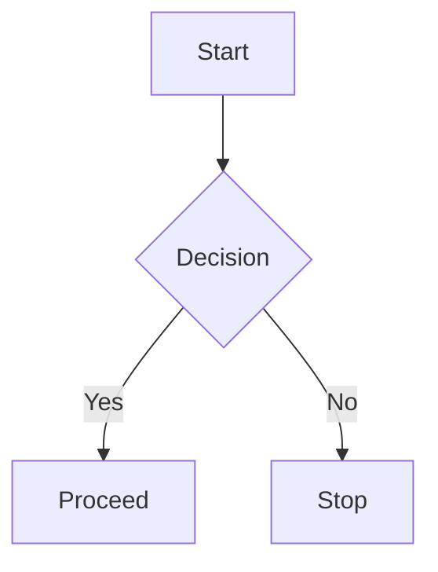

# Markdown Preview Enhanced

Use this skill when working with Markdown files that benefit from advanced preview features beyond the basic Cursor/VS Code preview.

## Core Capabilities

- **Math typesetting**: KaTeX or MathJax for inline and block equations.
- **Diagrams**: Native Mermaid, PlantUML, WebSequenceDiagrams support.
- **Scroll sync**: Automatic source ↔ preview synchronization.
- **Export**: PDF, HTML, Pandoc-powered formats (DOCX, LaTeX, etc.).
- **Code chunks**: Executable code blocks with output rendering.
- **Presentations**: Slide mode from Markdown.

## When to Activate

- User opens or edits `.md` / `.markdown` files.
- Requests involving equations, diagrams, or technical reports.
- Exporting documentation or generating PDFs from Markdown.
- Using Mermaid, PlantUML, or math in notes.

## Quick Start

1. Open any `.md` file.
2. Run the preview command (default: `ctrl+shift+v` or `cmd+shift+v`).
3. The enhanced preview pane appears with full feature support.

## Math

Use standard LaTeX syntax:

```markdown
Inline: $E = mc^2$

Block:
$$
\int_{-\infty}^{\infty} e^{-x^2} dx = \sqrt{\pi}
$$
```

The extension renders with KaTeX by default (fast) or MathJax if configured.

## Diagrams

### Mermaid (built-in)



### PlantUML


## Scroll Sync

Enabled by default. Cursor position in source automatically scrolls the preview and vice versa.

## Export

- PDF: Use command palette → “Markdown Preview Enhanced: Export to PDF”
- Other formats via Pandoc integration (configure in settings).

## Keybindings (VS Code / Cursor)

| Shortcut              | Action                          |
|-----------------------|---------------------------------|
| ctrl+shift+v          | Open preview                    |
| ctrl+shift+s          | Sync source ↔ preview           |
| cmd+k v               | Open preview to side            |

## Configuration Tips

- Set `"markdown-preview-enhanced.mathEngine": "katex"` for speed.
- Enable PlantUML server or use local jar for offline diagrams.
- For large reports, use `<!-- @import "section.md" -->` to compose files.

## Best Practices

- Keep individual `.md` files under ~500 lines for fast preview.
- Use Mermaid for architecture diagrams in system design reports.
- Embed equations directly in requirements or analysis sections.
- Export final deliverables to PDF for stakeholders.

## Related Skills

- Pair with `system-design-report-generator` or `tech-report-generator` when producing long-form Markdown output.
- Use `mdtohtml` for web-ready HTML versions when needed.

This skill ensures the agent fully exploits the extension’s power for professional Markdown authoring.