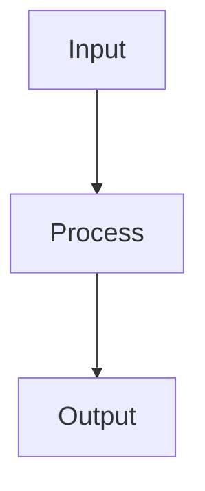

# Mermaid Doc Readability

Specialist pass after a diagram exists. Authoring entry: [mermaid](../mermaid/SKILL.md).

## Pipeline

1. Shorten labels and merge low-value nodes.
2. Prefer `flowchart TB` for long chains.
3. Increase legibility with Mermaid init config:



4. Validate:

```bash
mmdc -i <diagram.mmd>
mmdc -i <doc.md>
```

5. Remove temporary `*.svg` validation artefacts.

## Companion

- Preview / zoom: [markdown-viewer-user-pack](../markdown-viewer-user-pack/SKILL.md)
- Parser-safe labels: [mermaid](../mermaid/SKILL.md) prohibited-characters table
- Themed export after cleanup: [pretty-mermaid](../pretty-mermaid/SKILL.md)
