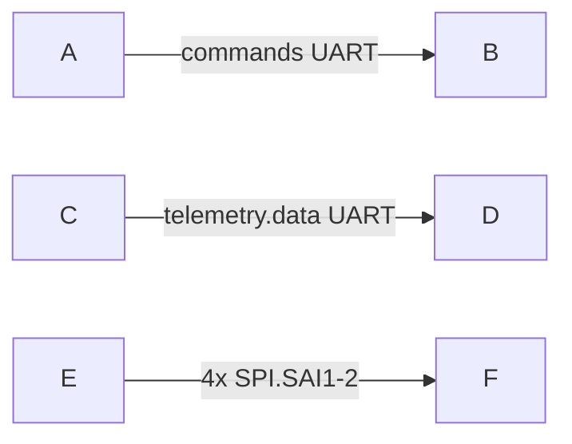

# Mermaid Diagram Skill

**Cluster entry.** Author and validate here; open specialists only when the goal matches the table.

| Goal | Skill |
|------|--------|
| Create / edit / fix Mermaid; validate `.mmd` | **This skill** (pipeline below) |
| `mmdc` install, flags, SVG/PNG/PDF CLI | [mmdc](../mmdc/SKILL.md) |
| Themed SVG, ASCII art, batch themes | [pretty-mermaid](../pretty-mermaid/SKILL.md) |
| Cluttered / tiny / hard-to-scan charts | [mermaid-doc-readability](../mermaid-doc-readability/SKILL.md) |
| SysML deploy interconnection charts | [sysml-interconnection-mermaid](../sysml-interconnection-mermaid/SKILL.md) |

Ordered **pipeline** below; **`templates/`** and **`examples/`** are reference snippets (same role as `assets/` templates in generator-style skills).

## Core Workflow

Follow these steps for every diagram creation/modification:

### 1. Understand the Request
- Identify the diagram type needed (flowchart, sequence, class, etc.)
- Extract key elements: entities, relationships, flow, hierarchy
- Determine if creating new, editing existing, or generating from code

### 2. Generate Mermaid Code
- Create syntactically correct Mermaid diagram code
- Use appropriate diagram type syntax
- Apply consistent naming and styling
- Refer to `examples/` directory for type-specific syntax (load on-demand)
- **Interconnection / architecture flowcharts:** **[sysml-interconnection-mermaid](../sysml-interconnection-mermaid/SKILL.md)** (canonical pipeline); placement detail [references/mermaid-placement-by-degree.md](references/mermaid-placement-by-degree.md). Model inventory: [architecture-diagrams.md](references/architecture-diagrams.md).

### 3. Save to File
- Write code to `.mmd` file
- Generate meaningful filename based on diagram purpose (e.g., `user-authentication-flow.mmd`, `database-schema.mmd`)
- Use kebab-case for filenames

### 4. Validate with CLI (MANDATORY)
- **ALWAYS** validate using: `mmdc -i <filename>.mmd`
- Check for syntax errors and warnings
- **NEVER skip this step** — validation catches parse errors before export
- If validation fails, proceed to step 5

### 5. Auto-Correct Errors
- Analyze error messages from `mmdc`
- Common issues:
  - Invalid syntax or keywords
  - Missing quotes around labels with spaces
  - Incorrect arrow syntax
  - Malformed node definitions
- Automatically fix the code
- Re-save and re-validate
- Repeat until validation succeeds

### 6. Render on Request

**Validate first** — always `mmdc` before any export.

| Output | Command / skill |
|--------|-----------------|
| SVG/PNG/PDF (default CLI) | `mmdc -i file.mmd -o file.svg` ([mmdc](../mmdc/SKILL.md)) |
| **Themed SVG** (slides, static embed) | [pretty-mermaid](../pretty-mermaid/SKILL.md) — `node ~/.cursor/skills/pretty-mermaid/scripts/render.mjs -i file.mmd -o file.svg --theme github-light` |
| ASCII (README / terminal) | pretty-mermaid `--format ascii` |
| Cluttered / hard to scan | [mermaid-doc-readability](../mermaid-doc-readability/SKILL.md) |
| Fenced block in report `.md` | No export — preview only; follow [state-diagram-layout.md](references/state-diagram-layout.md) for behaviour charts |

Bridge doc: [references/pretty-mermaid-bridge.md](references/pretty-mermaid-bridge.md) · upstream [Pretty-mermaid-skills](https://github.com/imxv/Pretty-mermaid-skills).

Only render files when the user asks for an image asset or themed export.

### 7. Iterative Refinement (Strongly Recommended)
- Validate **early and often** — do not wait until the diagram is "finished".
- Fix one class of error at a time (Unicode characters → punctuation in labels → structural keywords).
- After every significant edit, re-run `mmdc -i file.mmd` before continuing.
- Keep the same descriptive filename (like a `preview_id`) across iterations so you can quickly re-validate and compare.
- Only present the final diagram to the user after it validates cleanly.

## Supported Diagram Types

Load examples from `examples/` directory as needed:

**Basic Diagrams:**
- Flowchart (`examples/flowchart.md`)
- Sequence Diagram (`examples/sequence.md`)
- Class Diagram (`examples/class.md`)
- State Diagram (`examples/state.md`)
- Entity Relationship (`examples/er.md`)

**Planning & Management:**
- Gantt Chart (`examples/gantt.md`)
- User Journey (`examples/journey.md`)
- Timeline (`examples/timeline.md`)
- Kanban (`examples/kanban.md`)

**Data Visualization:**
- Pie Chart (`examples/pie.md`)
- XY Chart (`examples/xy-chart.md`)
- Quadrant Chart (`examples/quadrant.md`)
- Sankey (`examples/sankey.md`)
- Radar (`examples/radar.md`)
- Treemap (`examples/treemap.md`)

**Technical Diagrams:**
- Git Graph (`examples/git.md`)
- C4 Diagram (`examples/c4.md`)
- Requirement Diagram (`examples/requirement.md`)
- Architecture (`examples/architecture.md`)
- Block Diagram (`examples/block.md`)
- Packet (`examples/packet.md`)

**Organizational:**
- Mindmap (`examples/mindmap.md`)
- ZenUML (`examples/zenuml.md`)

## Code Analysis → Diagram

When analyzing code to create diagrams:

**Class Diagrams:**
- Extract classes, methods, properties, inheritance, interfaces
- Show relationships: inheritance, composition, aggregation

**Sequence Diagrams:**
- Track function calls, async operations, API interactions
- Show actors, lifelines, activation boxes

**Flowcharts:**
- Map control flow, conditionals, loops
- Show function entry/exit points

**State Diagrams:**
- Identify states from enums, state machines, status fields
- Map transitions and events
- **Layout:** [references/state-diagram-layout.md](references/state-diagram-layout.md) — flat `stateDiagram-v2`, `direction TB` for recovery loops; self-loops in tables

## Templates

Common patterns available in `templates/common-patterns.md` (load on-demand):
- Standard flowchart structures
- API sequence patterns
- Database ER patterns
- Microservice architecture layouts
- State machine templates

## Best Practices

**Styling:**
- Use meaningful node IDs
- Add clear, concise labels
- Apply subgraphs for grouping related elements
- Use classDefs for visual consistency

**SysML deployment / interconnection flowcharts** (markdown in `projects/<name>/outputs/`):
- Prefer **layered** layout (core LAN → field uplink → edge/station chains), **short edge labels** with a **legend** mapping to deploy ports and SysML link names, and **one diagram per intent** (full deploy vs scale-out fabric only). Full checklist: [sysml-view-doc-sync/references/interconnection-mermaid.md](../sysml-view-doc-sync/references/interconnection-mermaid.md). Repo rules: [repo-mermaid-rules](references/repo-mermaid-rules.md).
- For flowcharts, prefer **single-direction edges** (`-->`) when labels or parser quirks are involved; if you need bidirectional meaning, show two explicit one-way edges and keep the label short. This avoids Mermaid parser issues that can appear with labeled bidirectional links in merged report packs.
- When validating a merged report pack, validate the merged `.md` first, then isolate the failing chart if `mmdc` reports a parse error. The quickest fix is often to replace an ambiguous link or a label containing punctuation with simpler node text or a legend entry.
- Prefer a **clean overview** over a fully literal wire dump: when several channels connect the same two blocks, collapse them into **one labeled edge** and move per-channel detail to the caption, legend, or adjacent table. Only draw separate edges when the distinction is important to the reader.
- Protocol-first labels: name the actual protocol or signal class on the edge when it matters (`SPI1, SPI2, I2C`, `UART`, `Ethernet`, `analog X Y`). If a role label is needed, append it tersely (`UART bridge`, `SPI bridge`).
- Parser-safe labels: **avoid Unicode/special characters** in edge labels. Replace with ASCII equivalents:
  - En-dash `–` → hyphen `-`
  - Em-dash `—` → hyphen `-`
  - Arrow `->` (keep as is)
  - Double arrow `↔` → `<->`
  - Multiplication `×` → `x`
  - Section symbol `§` → `s.`
  - Avoid `!`, `/`, `\`, `:` unless label is quoted
  - Keep protocol name short and exact; explain full channel list in text or legend.
- If a label is only needed for traceability, move the full name into a legend line instead of the edge itself.
- For a controller mounted on a HAT or carrier, show the **physical HAT-to-controller links** only in the overview diagram; keep logical software telemetry out of the wire view unless the diagram’s purpose is software flow.

**Readability:**
- Keep diagrams focused (split large diagrams into smaller ones)
- Use top-to-bottom or left-to-right orientation consistently
- Add comments in code for complex sections (`%%` title line for identity in exports)

**Validation:**
- NEVER skip validation step
- Always fix errors before presenting to user
- Test rendered output when in doubt

## Prohibited & Problematic Characters in Mermaid

**NEVER use in edge labels without quoting:**

| Symbol | Issue | Replacement | Example |
|--------|-------|-------------|---------|
| `(` `)` | Lexical parse error | Remove or quote label | ❌ `\|data (v1)\|` → ✅ `\|data v1\|` |
| `,` | Parser confusion in labels | Use `.` or remove | ❌ `\|spot metrics, commands\|` → ✅ `\|spot metrics.commands\|` |
| `–` (en-dash) | Unicode parse error | Use `-` (hyphen) | ❌ `\|SPI1–4\|` → ✅ `\|SPI1-4\|` |
| `—` (em-dash) | Unicode parse error | Use `-` (hyphen) | ❌ `\|input—output\|` → ✅ `\|input-output\|` |
| `→` | Unicode parse error | Use `->` (ASCII) | ❌ `\|arrow →\|` → ✅ `\|arrow ->\|` |
| `↔` | Unicode parse error | Use `<->` (ASCII) | ❌ `\|bidirectional ↔\|` → ✅ `\|bidirectional <->\|` |
| `×` | Unicode parse error | Use `x` | ❌ `\|4×SPI\|` → ✅ `\|4x SPI\|` |
| `§` | Unicode parse error | Use `s.` | ❌ `\|section §2\|` → ✅ `\|section s.2\|` |
| `/` | Parser quirk | Quote label or use `-` | ⚠️ `\|SPI/I2C\|` (risky) → ✅ `"SPI/I2C"` or `\|SPI-I2C\|` |
| `\` | Parser quirk | Quote label or avoid | ⚠️ Use quotes: `"path\file"` |
| `:` | Parser quirk (time context) | Quote label or avoid | ⚠️ `"key: value"` or use `-` → `key-value` |
| `\|` (pipe) | Syntax conflict | Quote label | ⚠️ `"A \| B"` (needs escaping) |
| `!` | Syntax conflict | Quote label or avoid | ⚠️ `"important!"` (risky) → ✅ Avoid or quote |
| `#` | Hex color or comment | Quote or avoid | ⚠️ `"color #fff"` (risky) → ✅ Quote if needed |
| `&` | HTML entity risk | Quote or use word | ⚠️ `"A & B"` → ✅ `"A and B"` |
| `<` `>` | Arrow/syntax conflict | Use quotes or ASCII | ⚠️ `"A < B"` (risky) → ✅ `"A less than B"` |
| `{}` | Mermaid styling | Quote label or avoid | ⚠️ `"{styled}"` (risky) → Avoid |
| `[]` | Context-dependent | Quote if in label | ⚠️ Risky in some contexts |
| `"` | String quote conflict | Escape or use single quotes | ⚠️ `"He said "hello""` → Use `'single quotes'` or escape |

**Safe alternatives:**
- Use **hyphens** `-` for ranges and separators
- Use **dots** `.` for lists or chains
- Use **words** instead of symbols: `and` instead of `&`, `or` instead of `\|`
- **Quote complex labels**: `"label with spaces"`
- **Move detail to legend** instead of cramming into edge labels

### Examples of Fixed Labels

❌ **Bad (causes parse errors):**
```mermaid
flowchart LR
  A -->|commands (UART)| B
  C -->|telemetry, data (UART)| D
  E -->|4×SPI, SAI1–2| F
```

✅ **Good (parser-safe):**


**Legend for detailed mapping (in caption or table):**
- UART: commands (v1)
- telemetry: 32-bit fields
- 4x SPI: channels 1-4
- SAI1-2: high-speed ADC interface

## Error Handling

If `mmdc` validation fails:
1. Read error message carefully
2. Identify line number and issue
3. Check **[Prohibited & Problematic Characters](#prohibited--problematic-characters-in-mermaid)** table for symbol-related issues
4. Apply fix:
   - Replace Unicode chars with ASCII (see table)
   - Remove or quote problematic punctuation in labels
   - Move complex detail to legend/caption instead of edge labels
5. Re-validate
6. Inform user only if repeated attempts fail

**Common fix sequence:**
- Parse error mentioning `Expecting` → check for unquoted parentheses, commas, or semicolons `;` in labels
- `Lexical error` → check for Unicode special characters (–, —, →, ↔, ×, §)
- `PUNCTUATION` token error → check for `/`, `:`, `!`, `;` in unquoted labels
- Semicolon `;` inside a node label produces "Expecting 'SPACE', 'GRAPH'..." — replace with comma or rephrase the label
- Multiplication sign `×` inside labels is rejected — always use ASCII `x`
- HTML line breaks: use self-closing `<br/>` (not `<br>`) inside Mermaid node labels
- `style` statements are **not supported** inside `sequenceDiagram` — remove them or move styling to a separate flowchart

## Output Format

Present to user:
```
Created: <filename>.mmd

<Show the mermaid code in a code block>

✓ Validated successfully with mermaid-cli
```

If rendered:
```
Created: <filename>.mmd
Rendered: <filename>.svg

[Show file paths]
```

## Notes

- **mmdc** (mermaid-cli): [mmdc](../mmdc/SKILL.md). Install: `npm install -g @mermaid-js/mermaid-cli` or `npx @mermaid-js/mermaid-cli`
- **pretty-mermaid** (themed SVG/ASCII): [pretty-mermaid](../pretty-mermaid/SKILL.md) · [bridge](references/pretty-mermaid-bridge.md)
- **Readability pass:** [mermaid-doc-readability](../mermaid-doc-readability/SKILL.md)
- **Behaviour state machines:** [state-diagram-layout.md](references/state-diagram-layout.md)
- **Interconnection placement:** [mermaid-placement-by-degree.md](references/mermaid-placement-by-degree.md)
- Default CLI output format: SVG
- Always validate before presenting; fix errors autonomously
- Only load example files when needed for a specific diagram type
