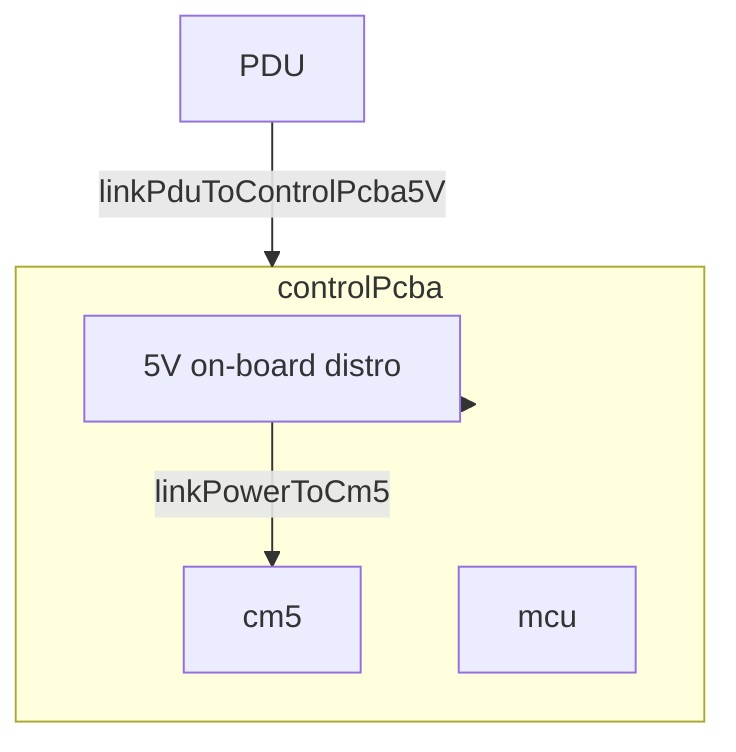
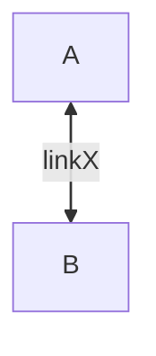

# Architecture Diagrams from SysML Deploy (model-first)

**Audience:** LLM editing `outputs/**` Mermaid architecture / interconnection figures in this repo. **Source of truth:** `projects/<name>/models/deploy-*.sysml` (and nested `part def` bodies for on-board links). **Never** invent parts, ports, or `link*` names not in the model.

**Rule:** In architecture block diagrams:
- **Blocks / nodes** = **Part usages** (deploy `part <usage> : <Type>`).
- **Arrows / edges** = **Items** (the conveyed item on the connection, or the connection name when it represents the flow item).

Pair with: [viewport-and-layout.md](viewport-and-layout.md), [edge-label-parser-safety.md](edge-label-parser-safety.md), [mermaid-placement-by-degree.md](mermaid-placement-by-degree.md), [sysml-view-doc-sync interconnection-mermaid](~/.cursor/skills/sysml-view-doc-sync/references/interconnection-mermaid.md).

---

## 1. Pipeline (mandatory order)

| Step | Action |
|------|--------|
| 1 | Read `projects/<name>/config.yaml` → `deployment_part`. |
| 2 | Open `models/deploy-*.sysml` → locate `part def <deployment_part> { ... }`. |
| 3 | Inventory `part <usage> : <Type>` under that def (deployment usages only on overview figures). |
| 4 | Inventory `connection link<Name>` whose ends are in scope for the figure; note `bind` for power aliases. |
| 5 | For edges that start/end **inside** `controlPcba` (or similar), also read that `part def` for `linkMcuTo*` / `linkPowerTo*`. |
| 6 | **Classify** links → one Mermaid figure per intent (power / command / field signal / optical / software / radiation). |
| 7 | Draw: **node id = part usage name**; **edge label = exact `link*` name** (single line, ASCII). |
| 8 | Caption: collapsed links, port paths, options (`coarseCameraOption`). |
| 9 | `mmdc -i <section>.md` before done. |

---

## 2. Internal vs deployment connections

| Layer | Where in model | Use in diagram |
|-------|----------------|----------------|
| **Deployment** | Inside `part def LeoLaserCommPATWithAcquisitionMcu` | Host↔PDU↔PCBA↔field; optical chain; `linkPcbaTo*` to peripherals |
| **On-board (nested)** | Inside `part def Cm5Stm32ControlPcba` | PCBA-1/2: `linkPowerToCm5`, `linkCm5ToMcuUart`, `linkMcuToQpdAdcSpi*`, `linkMcuToMems*`, `linkMcuToBeacon*` |
| **Software** | `allocate` + `SoftwareDataFlow` in deploy | Separate figure or software-allocation section — not mixed into power figure |

**Do not** draw `linkMcuToQpdAdcSpi1` and `linkPcbaToQpdSpi1` as one edge without a `quartetADC` node — the model has both layers.

---

## 3. Nested blocks (Mermaid subgraphs)

**Rule:** If a part usage is contained inside another part usage in the model, **use a Mermaid `subgraph`** (nested block).

Use `subgraph` when the model has **containment** (PCBA contains cm5/mcu/qpdModule, PDU contains pduMcu + firmware).

**When to nest**
- PCBA internal structure (`Cm5Stm32ControlPcba` contains `cm5`, `mcu`, `pcieEthController`).
- PDU internal (`patPdu` contains `pduMcu` + `PatPduFirmware`).
- Composite field units when expanded (`qpdModule` contains `pdFrontEnd` + `adcHat`).
- Optical chain when multiple stages share a physical module.

**Syntax**


**Bidirectional arrows (`<-->`)**
Mermaid’s default bidirectional markers can render with uneven arrowhead sizes. Force symmetry with:



**Rules**
- Subgraph label = **usage name** from deploy (`controlPcba`, `patPdu`).
- Internal nodes still use exact part usage names (`cm5`, `mcu`, `pcieEthController`).
- Edge labels crossing the subgraph boundary remain the deploy `link*` names.
- **Never render ports as blocks** (e.g. `beaconGpio`, `quartetADC`, `memsFclkOut` are ports). If a port hop is important, keep it in caption text.
- **No wildcard edge labels** (`*`) in diagrams. Use explicit collapsed aliases (e.g. `linkMcuToBeaconEnable/ModFreq`) and list exact links in caption.
- **Label collapsing** is allowed when multiple rails share a destination and the caption documents it.

  Example (before → after):
  ```
  PDU -->|linkPduToControlPcba5V| PCBA
  PDU -->|linkPduToControlPcba12V| PCBA
  ```
  becomes
  ```
  PDU -->|linkPduToControlPcba5V&12V| PCBA
  ```
  Caption must note the collapse.
- **Declare external consumers immediately after the subgraph** (before the main HOST→PDU edges) so Mermaid places them physically close and avoids long crossing lines.
- Do **not** nest software flows inside hardware power figures.
- Keep subgraph depth ≤ 2 (deployment → PCBA/PDU). Deeper nesting harms narrow-viewport readability.
- Do **not** draw child→parent edges for containment (e.g. node inside `qpdModule` must not also point to `qpdModule`).

**When not to nest**
- The inner element is a separate field unit (e.g. `qpdModule`, `memsDriver`, `beacon`) connected via `linkPcbaTo*` — these are external to the PCBA.
- The diagram is a high-level deployment overview and containment detail would add visual noise.

**Example (beacon power path)**

Correct (part → item → part):
```
PDU -->|beaconPowerOut5V| BCN
```

Incorrect (port / bind alias on edge):
```
PDU -->|switchOutBeacon5V| B5IN["powerOutBeacon_5V"]
B5IN -->|beaconPowerOut5V| BCN
```

---

## 4. Inventory table (handoff before drawing)

| id | intent | link_count | source_file |
|----|--------|------------|-------------|
| ARCH-1 | power | 12 | deploy-leo-cubesat-laser-comm.sysml |
| ARCH-2 | command | 4 | deploy-leo-cubesat-laser-comm.sysml |
| ARCH-3 | field_io | 15 | deploy+Cm5Stm32ControlPcba |
| ARCH-4 | optical | 5 | deploy-leo-cubesat-laser-comm.sysml |

Populate `link_count` after `rg "connection link"` for the deployment def.

---

## 5. Placement and rescue (when still messy)

**Primary:** [mermaid-placement-by-degree.md](mermaid-placement-by-degree.md) — MemNet `TSK_diagram_*` graph first (degree, `typedBy` split, rank_span gate, barycenter lanes, spoke-before-chord edge order), then materialise to `.md`. Serve down: Markdown `DiagramPlan`.

**Before placement:** apply split gate in [viewport-and-layout.md](viewport-and-layout.md) §2 (one intent per figure, ≤6 nodes).

**Legacy single-figure tactics** (only if split is impossible and placement graph still fails after 2 review passes):

1. **Hidden lanes** — `subgraph L1[" "]` + `style L1 fill:none,stroke:none`; one functional target per lane.
2. **Merge parallel edges** with caption note (e.g. `5V + 12V`).
3. **`curve: 'basis'`** in init block; `linear` only if arcs confuse.
4. **Power rails** — internal `5V rail` / `12V rail` nodes inside PCBA when power edges dominate.
5. **Edge-density gate** — >6 edges from one boundary → split subfigures.

If readability is still poor, split by intent — do not add fake layout nodes.

---

## 6. Checklist

- [ ] `deployment_part` read from `config.yaml`
- [ ] Every edge label matches a model `connection` or documented collapse in caption
- [ ] External consumers declared **immediately after** the subgraph (before HOST→PDU edges)
- [ ] Nested blocks (`subgraph`) used when a part usage is contained inside another part usage in the model
- [ ] Single-figure rescue protocol applied (placement → lanes → merges → rails) before deciding to split
- [ ] MemNet `TSK_diagram_*` placement graph or Markdown `DiagramPlan` before materialising fenced block ([mermaid-placement-by-degree.md](mermaid-placement-by-degree.md))
- [ ] Container interior is compact (no large blank bands caused by internal allocation)
- [ ] Edge-density gate checked (fan-out > 6 from one boundary triggers split or focused subfigure)
- [ ] No port usages rendered as blocks (`beaconGpio`, `quartetADC`, `memsFclkOut`, etc.)
- [ ] No wildcard (`*`) edge labels in figure text
- [ ] No child→parent edge where both are containment-related nodes
- [ ] No software `SoftwareDataFlow` on hardware power figures
- [ ] `mmdc` pass on edited section
