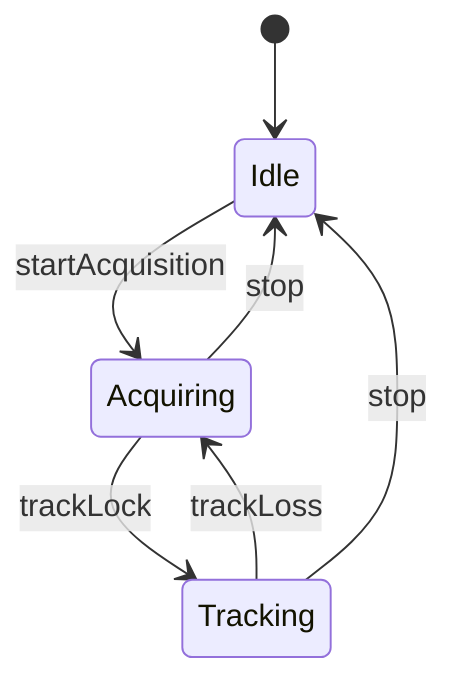
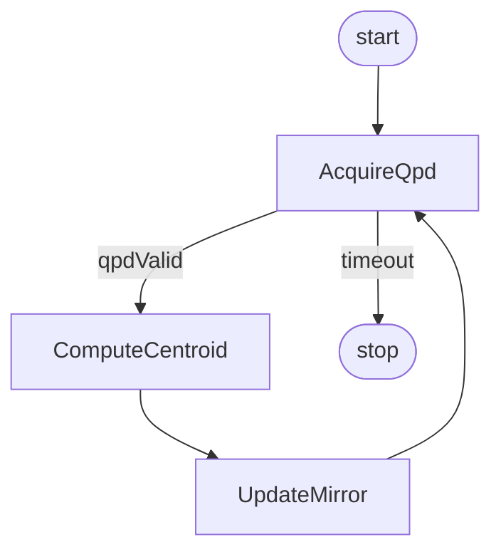
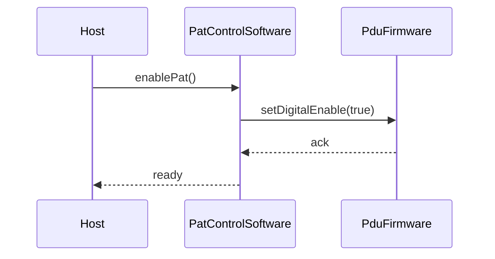

# Behaviour Diagrams from SysML (state machines, activities, sequence)

**Audience:** LLM editing `outputs/**` Mermaid behaviour figures in this repo. **Source of truth:** `projects/<name>/models/behaviour-*.sysml` (state machines, activities, interactions). **Never** invent states, transitions, or events not present in the model.

**Rule:** In behaviour diagrams:
- **Nodes** = States (or actions in activity diagrams).
- **Edges** = Transitions (event[guard]/action).
- Entry / exit / do actions are shown inside the state or on the transition.

---

## 1. State Machine Diagrams (state machine def)

**Typical structure**


**Rules**
- Use `stateDiagram-v2`.
- Initial state = `[*]`.
- Final state = `[*]` (if applicable).
- **Layout:** [state-diagram-layout.md](state-diagram-layout.md) — prefer **flat** lifecycle chart, **`direction TB`** when a recovery loop exists; put **multiple self-loops** in a table, not on the diagram.
- Composite states: only for true sub-regions with ≤3 internal transitions; max **one** nesting level.
- Show entry/exit/do actions inside the state **or** in the table below the figure (prefer table when >2 actions).
- Transition labels: `event[guard]/action` (single line, ASCII).
- Optional themed SVG: [pretty-mermaid-bridge.md](pretty-mermaid-bridge.md).

---

## 2. Activity Diagrams

**Typical structure**


**Rules**
- Use `flowchart TB` or `flowchart LR`.
- Actions = nodes.
- Decisions = diamond nodes with labelled outgoing edges.
- Forks / joins = thick bars (if parallel behaviour is modelled).

---

## 3. Sequence Diagrams (interactions)

Use when the model defines message flows between lifelines (e.g. software threads or hardware blocks with protocol).



**Rules**
- Use `sequenceDiagram`.
- Lifelines = part usages or software threads from the behaviour model.
- Messages = operation calls or signals defined in the model.
- Keep activation boxes minimal unless the model explicitly shows duration.

---

## 4. TOON inventory (handoff before drawing)

```toon
behaviourDiagram[4]{id,type,source_file}:
  SM-1,stateMachine,behaviour-leo-cubesat-laser-comm.sysml
  ACT-1,activity,behaviour-leo-cubesat-laser-comm.sysml
```

---

## 5. Checklist

- [ ] All states and transitions come from a `state machine def` in the behaviour model.
- [ ] Transition labels use `event[guard]/action` syntax when present.
- [ ] No deployment topology mixed into behaviour figures.
- [ ] `mmdc` pass on edited section.
