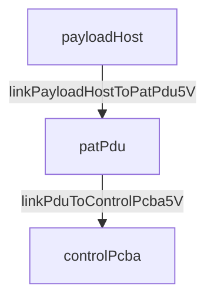

# Edge and link labels — parser safety (flowcharts)

**Audience:** LLM authoring ` ```mermaid ` blocks in `outputs/**/*.md` or `.mmd` files.

**Rule:** Edge labels (`A -->|label| B`) are **not** node labels. They use a stricter lexer in many Mermaid builds (Cursor preview, GitHub, older `mmdc`). When in doubt, use **one ASCII token** on the edge and put everything else in the caption, legend, or table below the figure.

Pair with: [repo-mermaid-rules.md](repo-mermaid-rules.md), [viewport-and-layout.md](viewport-and-layout.md).

---

## 1. Golden rules (edge labels)

| Rule | Do | Do not |
|------|-----|--------|
| **Single line** | One short label per edge | `\n` inside `\|...\|` |
| **ASCII only** | `to`, `bind`, `-`, `_` | `→` `↔` `–` `—` `×` `§` |
| **One link name** | `linkPduToControlPcba5V` | `linkPduToControlPcba5V\nbind powerOutBeacon_5V` |
| **No wildcards** | `linkPcbaToQpd` in prose as `linkPcbaToQpd*` | `\|linkPcbaToQpd*\|` on edge |
| **No slashes in unquoted labels** | `linkPcbaToQpdPower5V12V` or quoted `"5V/12V"` | `\|5V/12V\|` (often breaks) |
| **Length** | ≤ ~35 characters | Full part numbers + port lists |

**Node labels** (`["text\nline2"]`) may use `\n` sparingly (max ~3 lines). **Edge labels may not** — this is the most common repo mistake.

---

## 2. Lexical error patterns (diagnosis)

| Error symptom | Typical cause | Fix |
|---------------|---------------|-----|
| `Lexical error on line N` caret under `\n→` or `\n` | Newline + Unicode/symbol in **edge** label | Remove `\n`; drop `→`; use single SysML link id |
| `Expecting ... got 'ARROW'` | `→` or `->` **inside** edge label text | Remove arrow from label; arrow is only syntax `-->` |
| `Parse error` on `\|SPI1-4\|` | En-dash or range in label | `SPI1-4` with ASCII hyphen only |
| Silent preview failure | `*` in label (`linkMcuToBeacon*`) | Spell without `*` or move to legend |
| Works in `mmdc`, fails in IDE preview | Older embedded Mermaid | Apply **strictest** rules (this doc) |

**Real failure (fixed in leo-cubesat ARCH-1):**

```text
PDU -->|switchOutBeacon5V\n→ powerOutBeacon_5V| PCBA
                              ^ lexer stops here
```

**Fixed:**

```mermaid
PDU -->|switchOutBeacon5V| PCBA
```

Caption: *`switchOutBeacon5V` bind `powerOutBeacon_5V` on PCBA.*

---

## 3. Where detail goes instead

| On canvas (edge) | Below figure |
|------------------|--------------|
| `linkCm5ToPatPduUart` | uart0 / 921600 / `PowerDownControl` |
| `switchOutBeacon5V` | bind → `powerOutBeacon_5V` |
| `linkPcbaToQpd` | `linkPcbaToQpdPower5V/12V`, harness J1 |
| `SPI` | `SPI1-4`, pin map reference |

Use a **Figure N — …** caption plus optional **Legend:** bullet list mapping short edge text → SysML `connection` / `port` names.

---

## 4. Safe patterns (copy-paste)

**Deployment power (TB):**



**Bidirectional UART (two edges or one link id, not `↔` in label):**

```mermaid
CM5 <-->|linkCm5ToPatPduUart| PDU
```

**Optical Tx/Rx (prefer two directed edges if labels differ):**

```mermaid
EOM -->|linkOptoCommToAmplifierTx| AMP
AMP -->|linkAmplifierToGroundDownlink| GND
```

---

## 5. Validation workflow

1. Edit fenced block in section `.md`.
2. Run `mmdc -i path/to/section.md` (validates **all** blocks in file).
3. If error cites a line number, open that block only; check **edge** labels first (not nodes).
4. After fix, re-run `mmdc`; then refresh Markdown preview.
5. Do **not** commit stray `*.validate*.svg` from local tests — delete or gitignore.

**Windows (repo):**

```powershell
mmdc -i "sysml-v2-models/projects/<project>/outputs/system-design-report/02-architecture.md"
```

---

## 6. Checklist (before marking diagram done)

- [ ] No `\n` inside any `\|edge label\|`
- [ ] No Unicode arrows or dashes in edge labels
- [ ] No `*` wildcard in edge labels
- [ ] SysML link / port traceability in caption or table, not on edge
- [ ] `mmdc -i <file>.md` exit code 0
- [ ] Figure caption states reading order and omitted detail
