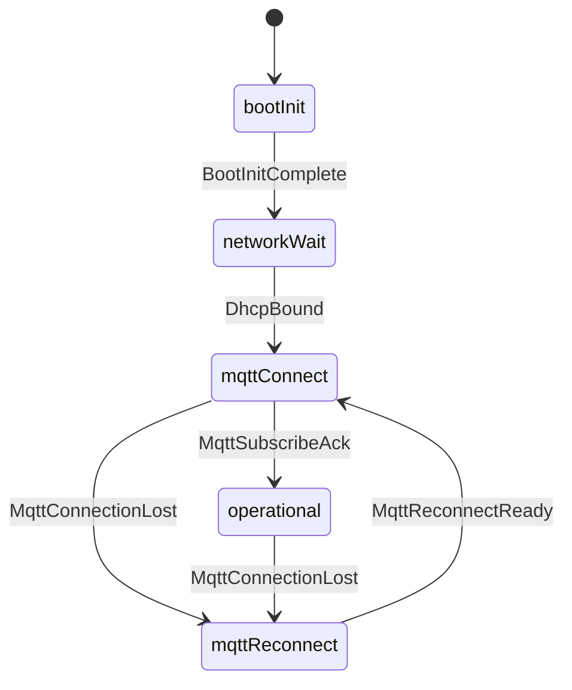

# State diagram layout (stateDiagram-v2)

**Audience:** LLM drawing firmware / behaviour state machines in `outputs/**`.  
**Upstream pattern:** [Pretty-mermaid state template](https://github.com/imxv/Pretty-mermaid-skills/blob/main/assets/example_diagrams/state.mmd) — flat states, clear transition labels.

Pair with [behaviour-diagrams.md](behaviour-diagrams.md) (SysML traceability) and [repo-mermaid-rules.md](repo-mermaid-rules.md) (short labels + legend).

---

## 1. Prefer flat lifecycle charts

**Do** — top-level states only, `direction TB`:



**Don't** — nested composite with many self-loops on an inner `idle` state (Mermaid draws one huge arc; labels overlap).

**Don't** — `direction LR` when the machine has a **recovery loop** (`mqttReconnect` → `mqttConnect`); use **TB** so return edges stay short.

---

## 2. Where to put operational detail

| On the diagram | In prose / table below |
|----------------|------------------------|
| Lifecycle states and **between-state** events | Entry / exit / do actions |
| Recovery and error paths | Self-loops on one state (MQTT cmds, watchdog, toggle sense) |
| Short transition labels | Full SysML event names |

**Rule:** If the model has **more than one self-loop** on the same state, list them in a **table** or bullet list — do not draw each as a separate edge.

Optional single summary self-loop is acceptable: `operational --> operational: MQTT and watchdog` — only when one edge is enough.

---

## 3. Direction and recovery loops

| Pattern | Direction |
|---------|-----------|
| Linear boot → run | `TB` or `LR` |
| Boot chain + reconnect loop | **`TB`** |
| ≤4 states, no back-edges | `LR` ok |

---

## 4. Composite states (use sparingly)

Use `state Active { ... }` only when the model defines a **true sub-region** with **few** internal transitions (≤3).  
Do **not** nest composite states deeper than **one** level ([Pretty-mermaid DIAGRAM_TYPES](https://github.com/imxv/Pretty-mermaid-skills/blob/main/references/DIAGRAM_TYPES.md)).

For entry actions in Mermaid:

```mermaid
state operational {
  entry / McuReadValveSourceToggle
  entry / McuPublishValveSourceState
}
```

Prefer the **table** for multiple entry actions if the diagram gets wide.

---

## 5. Notes vs tables

`note right of State` blocks widen the canvas and fight narrow Markdown preview. Prefer:

1. Short labels on edges  
2. One-line **legend** under the figure (short → full SysML event)  
3. **Table** for entry/self-loop actions  

---

## 6. Themed SVG export (optional)

After `mmdc` validates, themed SVG for slides / static embed:

```bash
node ~/.cursor/skills/pretty-mermaid/scripts/render.mjs \
  --input diagram.mmd \
  --output diagram.svg \
  --theme github-light
```

**Themes (light docs):** `github-light`, `zinc-light`, `tokyo-night-light`  
**Themes (dark docs):** `github-dark`, `tokyo-night`, `dracula`  

List all: `node ~/.cursor/skills/pretty-mermaid/scripts/themes.mjs`  
Full skill: [pretty-mermaid](../pretty-mermaid/SKILL.md) ([imxv/Pretty-mermaid-skills](https://github.com/imxv/Pretty-mermaid-skills)).

**Markdown preview** uses the fenced ` ```mermaid ` block; **pretty-mermaid** is for export-quality SVG/ASCII, not required for every edit.

---

## 7. Checklist

- [ ] States and transitions match `behaviour-*.sysml` (no invented events).
- [ ] `direction TB` for lifecycle + reconnect unless ≤4 states with no loop.
- [ ] Flat chart; self-loops documented in table if >1 event.
- [ ] `%% diagram-id` comment on line 1 inside the fence.
- [ ] Legend maps short labels → full names when abbreviated.
- [ ] `mmdc -i <section>.md` passes.
