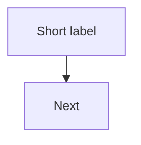

# Viewport, density, and layout (Mermaid in Markdown)

Use when diagrams render in **IDE Markdown preview**, **GitHub**, or **narrow windows** and appear too wide, too small, or cluttered.

Pair with [repo-mermaid-rules.md](repo-mermaid-rules.md) (labels, legends) and [mmdc](~/.cursor/skills/mmdc/SKILL.md) (validate).

---

## 1. Choose direction for viewport width

| Situation | Prefer | Avoid |
|-----------|--------|--------|
| **>6 nodes in one row**, long chains, deployment “fabric” | `flowchart TB` | `flowchart LR` spanning full screen |
| **≤4 peers**, timeline, simple pipeline | `flowchart LR` | — |
| **Many subgraphs**, PCBA + field peripherals | **Split** into 2–4 smaller TB diagrams | One mega-diagram with nested subgraphs + external nodes |
| State machines | `stateDiagram-v2` + `direction TB` | LR + recovery loops; nested multi self-loop composites — see [state-diagram-layout.md](state-diagram-layout.md) |

**Rule of thumb:** If horizontal scroll appears in preview, switch to **TB** or **split**.

---

## 2. Split diagrams by reader intent

One diagram should answer **one question**. For hardware docs (e.g. control PCBA):

| Figure | Intent | Typical nodes |
|--------|--------|----------------|
| Power | Who feeds whom? | host → PDU → rails |
| Compute | What runs on-board? | CM5 ↔ STM32, software |
| Edge | Connectors → field | port list → mates |
| Data path A | Camera / sensor leg | 3–5 nodes vertical |
| Data path B | Network / optical leg | stack vertically |

Cross-reference with **tables** for pin names and SysML link IDs — do not put every wire on one canvas.

**After split:** run placement algorithm ([mermaid-placement-by-degree.md](mermaid-placement-by-degree.md)) — MemNet graph first, then materialise to `.md`. Split gate runs **before** degree / rank assignment.

---

## 3. Init block (legibility)

Put immediately after the opening fence (before `flowchart`):



| Knob | Narrow / dense docs | Large export / poster |
|------|---------------------|------------------------|
| `fontSize` | `13px`–`15px` | `18px`–`22px` |
| `nodeSpacing` | `14`–`22` | `40`–`60` |
| `rankSpacing` | `22`–`32` | `60`–`90` |

**Do not** rely on init alone to fix a 15-node LR diagram — **restructure** first.

---

## 4. Subgraphs on narrow screens

- Set **`direction TB`** inside subgraphs when the parent is `flowchart TB`.
- **≤5 nodes** per subgraph; spill to another figure if larger.
- Subgraph **title** ≠ duplicate inner node label (see repo-mermaid-rules §4.2).
- Avoid **>2 levels** of nested subgraphs in Markdown preview (older Mermaid builds fail); flatten or split.

---

## 5. Node and edge labels

- **Nodes:** max ~3 lines (`\n` inside `["..."]` only); move firmware lists to caption.
- **Edges:** **single-line ASCII only** — no `\n`, no `→`/`↔` inside `\|...\|`; see [edge-label-parser-safety.md](edge-label-parser-safety.md).
- Prefer **abbreviations** on nodes: `LI-IMX900C` not full part number on canvas.
- **Bidirectional optics/data:** two explicit `-->` edges (Tx / Rx) or `<-->` with one short link id — not `↔` in label text.
- Collapse parallel wires: one edge `linkPcbaToQpd` + legend, not three edges with multiline labels.

---

## 6. Markdown-embedded workflow

1. Edit fenced ` ```mermaid ` block in `outputs/**/*.md`.
2. Extract block to temp `.mmd` if needed: `mmdc -i doc.md` validates **all** blocks in file.
3. Fix parse errors — [edge-label-parser-safety.md](edge-label-parser-safety.md) first, then main SKILL prohibited-char table.
4. Re-preview; if still unreadable, **split** or switch TB — not smaller font alone.
5. Optional export: `mmdc -i block.mmd -o figure.svg -b transparent`.

---

## 7. Validation checklist (viewport)

- [ ] No horizontal scroll at ~900px preview width (or split acknowledged in caption).
- [ ] Each figure has a **Figure N — …** caption and reading order.
- [ ] Legend / table carries SysML names omitted from edges.
- [ ] `mmdc -i <file>.md` or `mmdc -i <file>.mmd` passes.
- [ ] Title comment `%% …` on first line of each block.

---

## 8. Templates

- PCBA / deployment stack: [../templates/narrow-viewport-pcba.md](../templates/narrow-viewport-pcba.md)
- General patterns: [../templates/common-patterns.md](../templates/common-patterns.md)

## 9. Related repo skills

- [sysml-view-doc-sync interconnection-mermaid](~/.cursor/skills/sysml-view-doc-sync/references/interconnection-mermaid.md) — layered deploy diagrams
- [project-output-article/SKILL.md](~/.cursor/skills/project-output-article/SKILL.md) — outputs article structure
- User pack **mermaid-doc-readability** (if installed) — zoom/export via markdown-viewer; layout rules live here in repo **mermaid**
