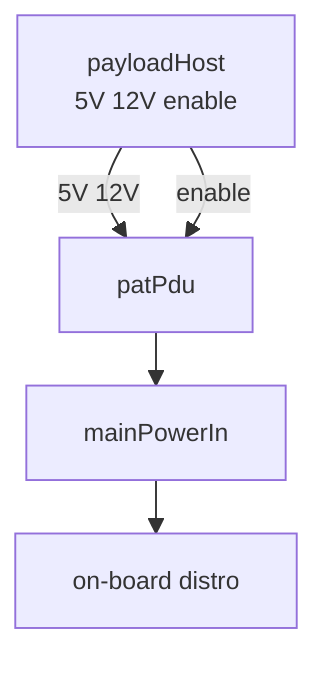
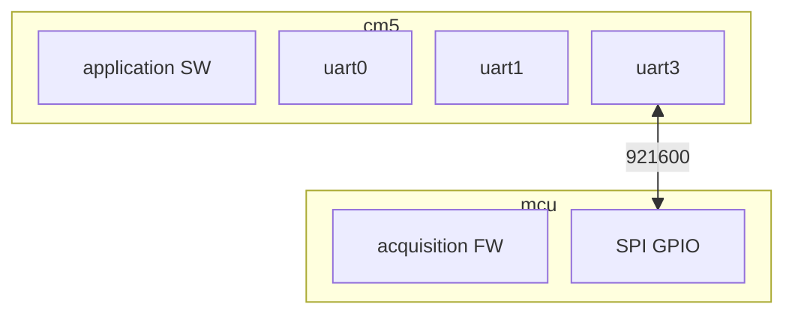
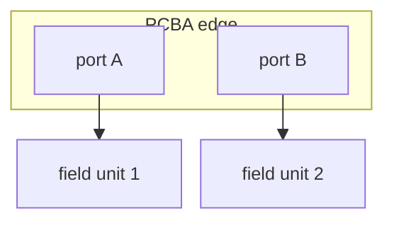
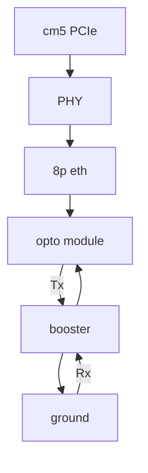

# Narrow-viewport templates (control PCBA / deploy hardware)

Copy-paste starters; replace IDs and labels from `deploy-*.sysml`.

## Power (TB)

## Compute on-board (TB)

## Edge → field (TB, one column)

## Short data leg (avoid LR chains)

---

**Edge labels:** use SysML **link** ids on edges (`linkPduToControlPcba5V`), not multiline or Unicode (`→`). Caption carries bind/uart detail. [edge-label-parser-safety.md](../references/edge-label-parser-safety.md).
