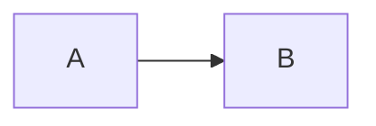

# Section file template (one topic per file)

Replace the heading and body; keep **`##`** text consistent with **`id`** / **`title`** in the hub `llm_toc`.

**MemNet:** After sync, add one `@CLM` per dense table row (link name, req id, de-facto part) — see [memnet-report-pipeline.md](../references/memnet-report-pipeline.md). Use exact deploy names so `@EDG` `mentions` resolve.

---

## Scope and sources

One paragraph: scope, assumptions, and which **`.sysml`** packages this section aligns with.

### Subsections (optional)

Use `###` for detail **under** the same `llm_toc` id (agents jump to the file + `##`).

